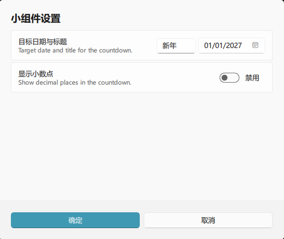

<h1>倒数日插件 / Countdown Days</h1>

## 介绍

~~西大不丢~~ Class Widgets 2 的倒数日插件！！！支持无限个小组件放置自定倒数日，且可以设置标题；

甚至能够支持在倒数日当天发送通知

### 截图

### 特性

- 支持无限个小组件放置自定倒数日
- 在倒数日当天发送通知提醒
- 我最可爱
- 24 MAN

## 致谢 / Acknowledgements
### 引用资源 / Credits
- [Class Widgets 2](https://github.com/rinlit-233-shiroko/class-widgets-2)
- [Class Widgets 2 SDK](https://github.com/Class-Widgets/class-widgets-sdk)

## 版权 / License
本项目基于 MIT 协议开源，详情请参阅 [LICENSE](https://github.com/rinlit-233-shiroko/class-widgets-2-plugin-template/blob/main/LICENSE) 文件。

The project is licensed under the MIT license. Please refer to the [LICENSE](https://github.com/rinlit-233-shiroko/class-widgets-2-plugin-template/blob/main/LICENSE) file for details.

#

Copyright © 2026 RinLit.
